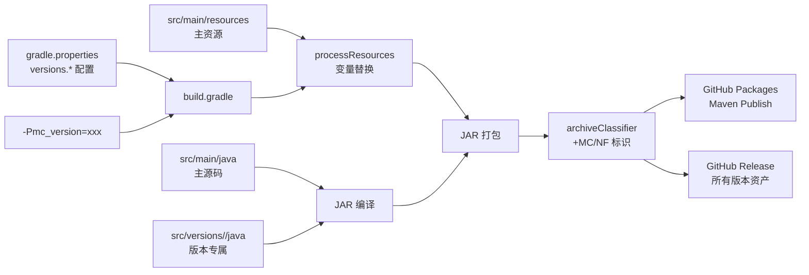
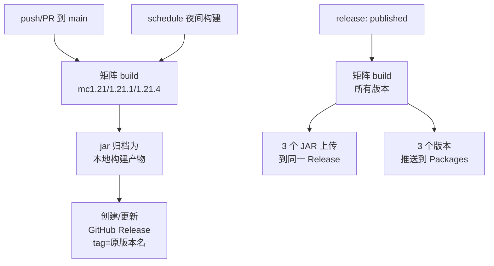
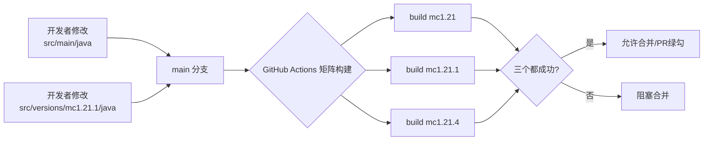
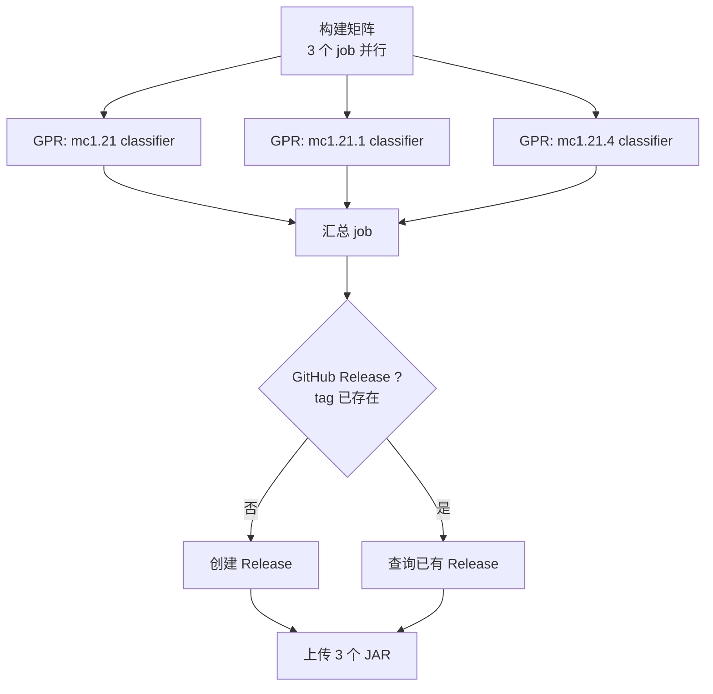
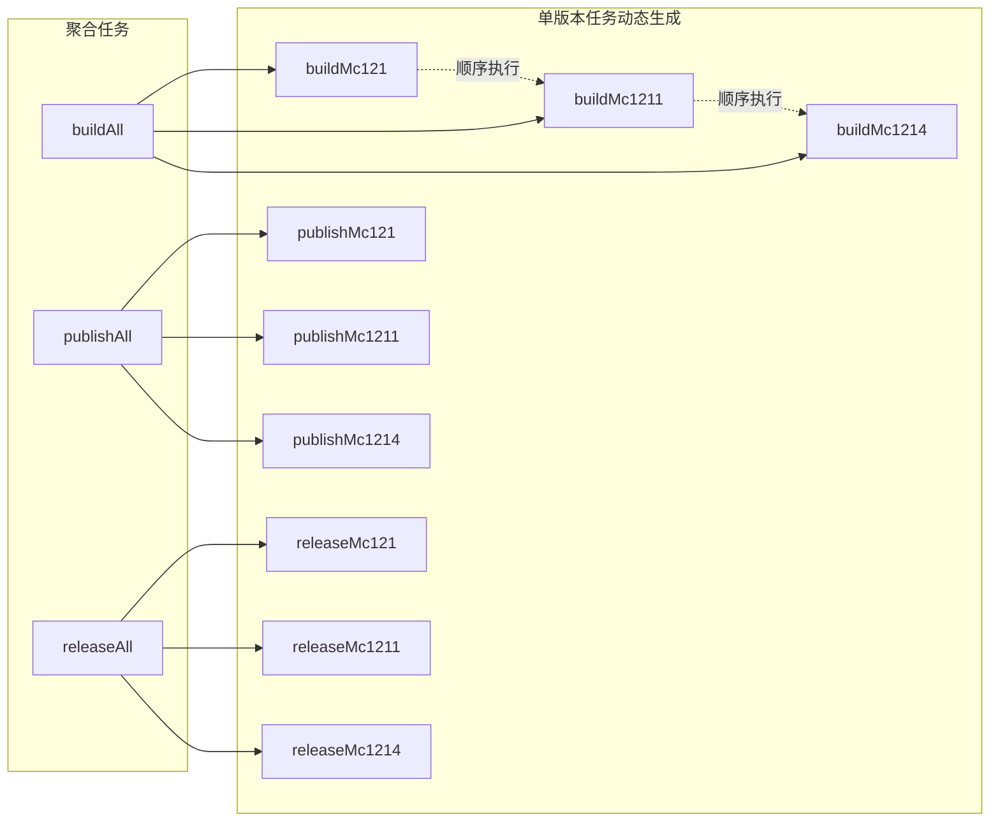

# 多版本 Minecraft/NeoForge 构建改造计划

> 目标：单一项目分支，通过 Gradle 构建矩阵 + `src/versions/<mc>/` 源码集，生成适配
> MC 1.21 / 1.21.1 / 1.21.4 三个 NeoForge 版本的 JAR；版本命名采用
> `1.5.0-dev-<git>+MC1.21.1NF21.1.115` 新格式；Release tag 保持原命名，JAR 文件名使用新格式，
> 一个 GitHub Release 同时推送所有版本 JAR 到 GitHub Packages。

---

## 1. 设计概览

### 1.1 设计目标

| 项              | 当前                                      | 目标                                                          |
|-----------------|-------------------------------------------|---------------------------------------------------------------|
| 版本命名        | `1.5.0-dev-a1b2c3d+20260929`              | `1.5.0-dev-a1b2c3d+MC1.21.1NF21.1.115`                        |
| JAR 文件名      | `more_decorative_blocks-1.5.0-dev-...jar` | `more_decorative_blocks-1.5.0-dev-...+MC1.21.1NF21.1.115.jar` |
| Release tag     | 当前即完整版本串                          | 保持原完整版本串（不带 MC/NF 后缀）                           |
| Release 资产    | 单个 JAR                                  | 同时上传 3 个版本 JAR（每个含 MC/NF 标识）                    |
| GitHub Packages | 单版本推送                                | 3 个版本同时推送                                              |
| 版本差异代码    | 无                                        | `src/versions/<mc>/` source set                               |
| 工作流          | 单分支构建                                | 矩阵构建所有版本                                              |

### 1.2 版本矩阵

| key        | minecraft_version | neo_version | neo_version_range | branch         |
|------------|-------------------|-------------|-------------------|----------------|
| `mc1.21`   | 1.21              | 21.0.x      | `[21.0,21.1)`     | NeoForge1.21   |
| `mc1.21.1` | 1.21.1            | 21.1.x      | `[21.1,21.2)`     | NeoForge1.21.1 |
| `mc1.21.4` | 1.21.4            | 21.4.x      | `[21.4,21.5)`     | NeoForge1.21.4 |

> 注：`minecraft_version_range` 与 `loader_version_range` 保留 `gradle.properties` 默认值（`[1.21,1.22)` / `[4,)`），
> 实际生效的精确版本由 `processResources` 动态替换为当前构建版本的变量。

### 1.3 数据流图



### 1.3.1 已确认的设计决策

| 项                          | 取值                                                                    |
|-----------------------------|-------------------------------------------------------------------------|
| Release `tag_name` / `name` | `1.5.0-dev-a1b2c3d`（原命名规范，不带 MC/NF 后缀）                      |
| JAR 文件名                  | `more_decorative_blocks-1.5.0-dev-a1b2c3d+MC1.21.1NF21.1.jar`（新规范） |
| `mod_version` 内部值        | `1.5.0-dev-a1b2c3d+MC1.21.1NF21.1.115`（带 NF 完整号）                  |
| 默认激活版本                | `mc1.21.1`（无 `-Pmc_version` 时）                                      |

### 1.4 工作流触发与构建关系



---

## 2. 配置改造

### 2.1 [`gradle.properties`](gradle.properties:1) — 增加版本矩阵

在文件末尾追加：

```properties
# ====================================================
# Multi-version build matrix
# Key format: <key>:<minecraft_version>:<neo_version>:<neo_version_range>:<parchment_mc>
# ====================================================
versions.mc1.21=1.21:21.0.x:[21.0,21.1):1.21
versions.mc1.21.1=1.21.1:21.1.x:[21.1,21.2):1.21.1
versions.mc1.21.4=1.21.4:21.4.x:[21.4,21.5):1.21.4

# Active version key (overridden by -Pmc_version=xxx)
# Default: keep backward-compatible with current main (1.21.1)
mc_version_key=mc1.21.1
```

并保留现有 `minecraft_version=1.21.1` / `neo_version=21.1.115` 作为单一版本构建时的回退值。

### 2.2 [`build.gradle`](build.gradle:1) — 完整重构

主要改造点：

1. **读取并解析 versions.* 配置**，根据 `mc_version_key`（默认）或 `-Pmc_version=xxx` 选择激活版本。
2. **`minecraft { version = ... }` 与 `dependencies { neoforge ... }`** 改为读取激活版本的变量。
3. **`mod_version` 命名规则改为** `<base>-<pre>-<git>+MC<mc_short>NF<nf_short>`
    - 例：`1.5.0-dev-a1b2c3d+MC1.21.1NF21.1.115`
    - 解析时：`mc_short` = 去掉点号保留原状的展示名（`1.21.1`），`nf_short` = NeoForge 版本前 2 段（`21.1`）。
4. **`jar.archiveClassifier`** 添加 `mc1.21.1-nf21.1`，最终文件名形如
   `more_decorative_blocks-1.5.0-dev-a1b2c3d+MC1.21.1NF21.1.115-mc1.21.1-nf21.1.jar`
   （classifier 段用于在同一发布物中区分多版本）。
5. **`processResources`** 中将 `replaceProperties` 中的 `minecraft_version` / `neo_version` / `neo_version_range`
   替换为当前激活版本的精确值（保持 `minecraft_version_range` / `loader_version_range` 不变）。
6. **`publishing`** 发布任务改名为 `publishGprAllVersions`，由矩阵调用多次，每次仅生成一个版本。
7. **`createGitHubRelease`** 任务：
    - 仅在传入 `-Pmc_version=xxx` 时由单矩阵项调用；
    - Release 的 `tag_name` / `name` 使用 `原始 mod_version`（去掉 `+MC...NF...` 后缀）以 **保持原 tag 命名规范**；
    - JAR 文件名使用 **新规范**（带 MC/NF）。

完整脚本结构（精简示意，最终在 Code 模式落地）：

```groovy
def activeVersionKey = project.findProperty('mc_version') ?: project.mc_version_key
def activeRaw = project.findProperty("versions.${activeVersionKey}")
if (!activeRaw) throw new GradleException("Unknown mc_version key: ${activeVersionKey}")

def (mcVer, nfVer, nfRange, parchMc) = activeRaw.split(':')
def mcShort = mcVer.replace('.', '')        // 1.21.1 -> 1211 ; 但显示用 mcVer 原样
def nfShort = nfVer.tokenize('.').take(2).join('.')  // 21.1.x -> 21.1

def mod_version = "${mod_version_base}-${mod_version_type}-${git}+MC${mcVer}NF${nfShort}"
def jarFileName = "${mod_id}-${mod_version}-mc${activeVersionKey.replace('mc','')}-nf${nfShort}.jar"

jar { archiveClassifier = "mc${activeVersionKey.replace('mc','')}-nf${nfShort}" }
```

### 2.3 模板变量

[`src/main/templates/META-INF/neoforge.mods.toml`](src/main/templates/META-INF/neoforge.mods.toml:1) 无需改动。
`${minecraft_version}` / `${neo_version}` / `${neo_version_range}` 占位符由 `processResources` 在每次构建时 根据激活版本动态展开。

### 2.4 [`src/versions/`](src/versions/) 源码集

```
src/versions/
├── mc1.21/
│   └── java/.../specific/        # 仅在该 MC 版本编译时启用
├── mc1.21.1/
│   └── java/.../specific/
└── mc1.21.4/
    └── java/.../specific/
```

每个目录包含一个 `package-info.java` 与可选的版本专属类（如 API 包装、签名兼容垫片）。 通过以下 Gradle 逻辑加入 source set：

```groovy
sourceSets {
    main {
        java.srcDirs += "src/versions/${activeVersionKey}/java"
    }
}
```

> 当前阶段先建立目录骨架与占位类，后续真正出现版本差异代码时直接落入对应目录。

---

## 3. 工作流改造

### 3.1 现状回顾

- [`.github/workflows/gradle-publish.yml`](.github/workflows/gradle-publish.yml:1)：单分支（NeoForge1.21）
  push/PR/schedule → 构建 → 发布到 Packages + 创建 Release。
- [`.github/workflows/gradle.yml`](.github/workflows/gradle.yml:1)：CI 构建（无需改动）。

### 3.2 新版 [`gradle-publish.yml`](.github/workflows/gradle-publish.yml:1)

- 触发分支改为 `main`（单一开发分支）。
- 使用 GitHub Actions `strategy.matrix` 并行构建三个版本。
- 每项调用 `./gradlew clean build publish -Pmc_version=<key>`。
- Release 仅在 push 到 main / schedule 时创建（PR 跳过）：
    - `tag_name` = `${mod_version_base}-${mod_version_type}-${git}`（保持原命名）。
    - Release 名沿用相同。
    - 由于 matrix 每项都会执行 `createGitHubRelease`， 需要 **幂等化**：检测 tag 已存在则跳过创建并继续上传资产。
- 三个矩阵项产生的 JAR 通过 `actions/upload-artifact@v4` 收集，发布步骤在汇总 job 中完成上传。

### 3.3 新增 [`release.yml`](.github/workflows/release.yml:1)

- 触发：`on: release: { types: [published] }`。
- 与 3.2 共享构建步骤（可考虑拆出 `reusable workflow` 复用），但行为差异：
    - 不创建 Release（已由 GitHub 自动创建）。
    - **在 release job 中汇总三个版本的 JAR** 上传到该 Release。
    - 三个版本 JAR **全部推送到 GitHub Packages**（通过 `gradle publishGpr` 循环）。
- 文件命名（保留新规范）：
    - `more_decorative_blocks-1.5.0-dev-a1b2c3d+MC1.21NF21.0.jar`
    - `more_decorative_blocks-1.5.0-dev-a1b2c3d+MC1.21.1NF21.1.jar`
    - `more_decorative_blocks-1.5.0-dev-a1b2c3d+MC1.21.4NF21.4.jar`

### 3.4 Release 资产矩阵

```mermaid
flowchart LR
    subgraph "Release v1.5.0-dev-a1b2c3d"
        R1[+MC1.21NF21.0.jar]
        R2[+MC1.21.1NF21.1.jar]
        R3[+MC1.21.4NF21.4.jar]
    end
    subgraph "GitHub Packages"
        P1[mc1.21 - 1.5.0-dev-a1b2c3d+MC1.21NF21.0]
        P2[mc1.21.1 - 1.5.0-dev-a1b2c3d+MC1.21.1NF21.1]
        P3[mc1.21.4 - 1.5.0-dev-a1b2c3d+MC1.21.4NF21.4]
    end
    BuildMatrix --> R1 + R2 + R3
    BuildMatrix --> P1 + P2 + P3
```

---

## 4. 实施步骤（按 todo 顺序）

| #  | 步骤                                                                                                                                                                   | 输出文件                       | 状态 |
|----|------------------------------------------------------------------------------------------------------------------------------------------------------------------------|--------------------------------|------|
| 1  | 已完成上下文收集                                                                                                                                                       | —                              | ✅   |
| 2  | 已完成架构设计                                                                                                                                                         | —                              | ✅   |
| 3  | 在 [`gradle.properties`](gradle.properties:1) 添加 `versions.*` 与 `mc_version_key`                                                                                    | 修改 `gradle.properties`       | ⏳   |
| 4  | 重构 [`build.gradle`](build.gradle:1)（版本解析 + source set + jar classifier + 多版本 publish + 改造 `createGitHubRelease`）                                          | 重写 `build.gradle`            | ⏳   |
| 5  | 调整 [`processResources`](build.gradle:162) 中变量替换逻辑（每次构建使用激活版本）                                                                                     | `build.gradle` 内联            | ⏳   |
| 6  | 创建 [`src/versions/mc1.21/`](src/versions/mc1.21/) / [`mc1.21.1/`](src/versions/mc1.21.1/) / [`mc1.21.4/`](src/versions/mc1.21.4/) 骨架目录与占位 `package-info.java` | 新建 3 个 `package-info.java`  | ⏳   |
| 7  | 重写 [`.github/workflows/gradle-publish.yml`](.github/workflows/gradle-publish.yml:1)（main 分支 + 矩阵 + Release 资产上传）                                           | 修改 `gradle-publish.yml`      | ⏳   |
| 8  | 新建 [`.github/workflows/release.yml`](.github/workflows/release.yml:1)（`release: published` 触发，3 版本 JAR 上传 + 推送 Packages）                                  | 新建 `release.yml`             | ⏳   |
| 9  | 验证：本地 `./gradlew build -Pmc_version=mc1.21` / `mc1.21.1` / `mc1.21.4` 均能成功                                                                                    | 验证记录                       | ⏳   |
| 10 | 编写本计划文档并提交                                                                                                                                                   | `plans/multi-version-build.md` | ⏳   |

---

## 5. 兼容性 & 回退

- 现有 `minecraft_version` / `neo_version` 仍保留，作为单版本（无 `-Pmc_version`）构建时的回退。
- 现有 `gradle-publish.yml` 行为（NeoForge1.21 分支）已被新工作流取代；
  `NeoForge1.21.1` / `NeoForge1.21.4` 等远端分支不再被工作流监听（统一改在 main 开发）。
- 现有 `src/main/java` 中的所有源码保持不动，仅在需要版本差异时按需移入 `src/versions/<key>/`。

---

## 6. 已确认的设计决策

1. Release `tag_name` 使用原始 mod 版本串（如 `1.5.0-dev-a1b2c3d`），不带 MC/NF 后缀。
2. JAR 文件名采用新规范 `more_decorative_blocks-1.5.0-dev-a1b2c3d+MC1.21.1NF21.1.jar`。
3. 默认激活版本保持 `mc1.21.1`。
4. 保留构建脚本中现有的 ASM 冲突解决方案。
5. 所有版本代码全部在单一 `main` 分支开发（无需分支同步）。

---

## 7. 关键问题的设计与解答

### 7.1 Q1: 如何在一个版本中修改完成后同步到另一个版本？

**结论：单一 `main` 分支 + source set 隔离，无需跨分支同步。**

详细策略：

1. **单一权威源**：所有版本的代码都在同一个 `main` 分支，不存在"在某个版本改完再同步到另一个版本"的场景。
2. **代码三层划分**：
    - `src/main/java/...` — **通用代码**（所有版本共享）。这是开发主战场。
    - `src/versions/mc1.21/java/...` — **仅在 MC 1.21 编译**。
    - `src/versions/mc1.21.1/java/...` — **仅在 MC 1.21.1 编译**。
    - `src/versions/mc1.21.4/java/...` — **仅在 MC 1.21.4 编译**。
3. **差异代码最小化原则**：尽量保持 90%+ 的代码在通用层，只有真正因 MC/NF API 变化而不同的代码才放入
   `src/versions/<key>/`。
4. **API 垫片/适配器模式**：若某段逻辑在三个版本都存在但调用方式不同，可以在通用层定义接口，三个版本的 source set 分别提供实现类。
5. **CI 矩阵验证**：每次 push 到 main，CI 会并行构建 3 个版本，任何版本的编译失败都会阻断合并，自然保证改动兼容所有版本。



### 7.2 Q2: 如何避免 GitHub Packages 与 Release 推送冲突？

**结论：通过 Maven 坐标隔离 + Release 幂等化推送避免冲突。**

冲突来源主要有两种：

| 冲突类型         | 根因                                           | 解决方案                                                                                                                                                        |
|------------------|------------------------------------------------|-----------------------------------------------------------------------------------------------------------------------------------------------------------------|
| Maven 坐标冲突   | 同一版本号 + 同一 artifactId 在 GPR 上重复上传 | **使用 archiveClassifier 区分**：每个版本的 JAR 拥有独立的 classifier（如 `mc1.21-nf21.0`），Maven 坐标变为 `<artifactId>-<version>-<classifier>.jar`，互不冲突 |
| Release tag 冲突 | 多次构建尝试创建同名 tag 的 Release            | **幂等化逻辑**：检测到 tag 已存在时跳过创建，仅上传资产                                                                                                         |
| 并行构建写冲突   | 矩阵同时上传到同一 Release                     | **顺序合并**：在 release.yml 中使用 `needs` 链或汇总 job，序列化上传 3 个 JAR                                                                                   |
| 重复资产         | 同一 JAR 上传多次                              | **GitHub API 自动去重**（同名资产覆盖），无需额外处理                                                                                                           |

实施要点：

1. **`build.gradle` 中的 publishing 配置**：为每个激活版本设置独立的 `archiveClassifier`：
   ```groovy
   jar { archiveClassifier = "mc${mcVer.replace('.','')}-nf${nfShort.replace('.','')}" }
   // mc1.21 -> mc121-nf210, mc1.21.1 -> mc1211-nf211, mc1.21.4 -> mc1214-nf214
   ```
2. **`createGitHubRelease` 任务的幂等化**：当 API 返回 422（tag 已存在）时，直接转为查询并上传资产，不抛出错误。
3. **`release.yml` 中的资产上传**：使用 `needs: [build]` 确保所有构建完成后再由汇总 job 上传，避免并发写同一个 Release。
4. **本地缓存锁**：矩阵中每个版本的 build job 使用独立的 `gradle-cache` 路径（基于 mc_version 区分），避免缓存写竞争。



### 7.3 Q3: 如何在 Gradle 中添加三个项目不同的任务？

**结论：通过 Gradle 任务命名约定 + 子进程切换，避免单进程内 source set 切换的复杂性。**

三种实现方式对比：

| 方案                              | 优点                     | 缺点                     | 推荐        |
|-----------------------------------|--------------------------|--------------------------|-------------|
| **A. 注册多个独立命名任务**       | 直观，单次构建产出多版本 | 子进程方式略慢           | ✅ **推荐** |
| B. 使用复合构建 (composite build) | 完全隔离                 | 需要拆分子项目，复杂度高 | ✗          |
| C. 单一 jar + Classifier          | 配置最简                 | 资产文件名较长           | 备选        |

**采用方案 A**，具体结构：

```groovy
// 在 build.gradle 末尾
ext.versionKeys = ['mc1.21', 'mc1.21.1', 'mc1.21.4']

ext.versionKeys.each { key ->
    // 单版本构建：切换 -Pmc_version 再调用原生 build
    tasks.register("build${key.capitalize()}") {
        group = 'build'
        description = "Build JAR for ${key}"
        doLast {
            project.exec {
                workingDir project.rootDir
                commandLine './gradlew', 'clean', 'build', '-Pmc_version', key
            }
        }
    }
    // 单版本发布：推送 GitHub Packages
    tasks.register("publish${key.capitalize()}") {
        group = 'publishing'
        description = "Publish ${key} JAR to GitHub Packages"
        doLast {
            project.exec {
                workingDir project.rootDir
                commandLine './gradlew', 'publish', '-Pmc_version', key
            }
        }
    }
    // 单版本 Release 创建
    tasks.register("createGithubRelease${key.capitalize()}") {
        group = 'publishing'
        description = "Create GitHub Release for ${key}"
        doLast {
            project.exec {
                workingDir project.rootDir
                commandLine './gradlew', 'createGithubRelease', '-Pmc_version', key
            }
        }
    }
}

// 聚合任务
tasks.register('buildAll') {
    group = 'build'
    description = 'Build JAR for all MC/NF versions'
    dependsOn ext.versionKeys.collect { "build${it.capitalize()}" }
}

tasks.register('publishAll') {
    group = 'publishing'
    description = 'Publish all versions to GitHub Packages'
    dependsOn ext.versionKeys.collect { "publish${it.capitalize()}" }
}

tasks.register('releaseAll') {
    group = 'publishing'
    description = 'Create GitHub Release with all version JARs'
    dependsOn ext.versionKeys.collect { "createGithubRelease${it.capitalize()}" }
}
```

**注意**：子进程方案在性能上略逊（每个版本需重启 Gradle），但避免了单进程内切换 source set 带来的配置缓存失效、依赖解析重做等问题。考虑到
3 个版本通常 CI 一次完成，本地不频繁使用，可接受。

### 7.4 Q4: 如何在 build 时一键构建所有版本？

**结论：注册 `buildAll` / `publishAll` / `releaseAll` 三个聚合任务。**

完整任务图谱：



**本地使用示例**：

```bash
# 构建所有版本
./gradlew buildAll

# 仅构建某个版本
./gradlew build -Pmc_version=mc1.21.4

# 发布所有版本到 GitHub Packages
./gradlew publishAll

# 创建带全部 3 个 JAR 的 Release
./gradlew releaseAll

# 查看所有任务
./gradlew tasks --group build
./gradlew tasks --group publishing
```

**CI 工作流调用**：

```yaml
# gradle-publish.yml
- name: Build all versions
  run: ./gradlew buildAll

# release.yml
- name: Build all versions for release
  run: ./gradlew releaseAll
```

---

## 8. 最终验证清单

- [ ] 本地 `./gradlew build -Pmc_version=mc1.21` 成功
- [ ] 本地 `./gradlew build -Pmc_version=mc1.21.1` 成功
- [ ] 本地 `./gradlew build -Pmc_version=mc1.21.4` 成功
- [ ] 本地 `./gradlew buildAll` 依次产出 3 个版本 JAR
- [ ] CI 矩阵在 main 分支的 push/PR 上构建 3 个版本
- [ ] Release 触发时 3 个 JAR 上传到同一 Release
- [ ] GitHub Packages 同时存在 3 个版本（按 classifier 区分）
- [ ] 各版本 JAR 的 `META-INF/neoforge.mods.toml` 中 `version` 字段包含正确的 `+MC<...>NF<...>` 后缀
- [ ] Release tag 名称保持 `1.5.0-dev-a1b2c3d`（无 MC/NF）

```